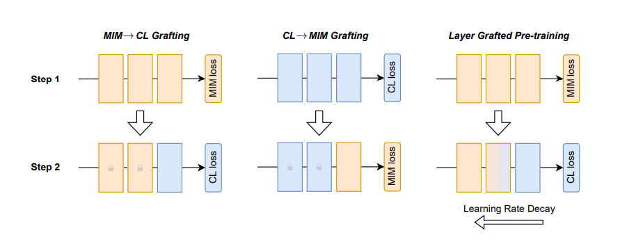

# Layer Grafted Pre-training: Bridging Contrastive Learning And Masked Image Modeling For Label Efficient Representations

## Introduction
This is a PyTorch implementation of [Layer Grafted Pretraining](https://openreview.net/forum?id=jwdqNwyREyh&referrer=%5BAuthor%20Console%5D(%2Fgroup%3Fid%3DICLR.cc%2F2023%2FConference%2FAuthors%23your-submissions)).

Recently, both Contrastive Learning (CL) and Mask Image Modeling (MIM)
demonstrate that self-supervision is powerful to learn good representations. However, naively combining them is far from success. In this paper, we start by making
the empirical observation that a naive joint optimization of CL and MIM losses
leads to conflicting gradient directions - more severe as the layers go deeper. This
motivates us to shift the paradigm from combining loss at the end, to choosing the
proper learning method per network layer. Inspired by experimental observations,
we find that MIM and CL are suitable to lower and higher layers, respectively. We
hence propose to combine them in a surprisingly simple, “sequential cascade”
fashion: early layers are first trained under one MIM loss, on top of which latter
layers continue to be trained under another CL loss. The proposed Layer Grafted
Pre-training learns good visual representations that demonstrate superior label efficiency in downstream applications, in particular yielding strong few-shot performance besides linear evaluation. For instance, on ImageNet-1k, Layer Grafted
Pre-training yields 65.5% Top-1 accuracy in terms of 1% few-shot learning with
ViT-B/16, which improves MIM and CL baselines by 14.4% and 2.1% with no
bells and whistles.



## Usage

### Pretrain Model Prepare
Download the MAE pre-trained models
```shell
mkdir pretrain
cd pretrain

wget https://dl.fbaipublicfiles.com/mae/pretrain/mae_pretrain_vit_base.pth 
wget https://dl.fbaipublicfiles.com/mae/pretrain/mae_pretrain_vit_large.pth
```

### Environment Setting
```shell
conda create -n layerGrafted python=3.6 -y
conda activate layerGrafted

# pytorch
conda install pytorch==1.8.0 torchvision==0.9.0 torchaudio==0.8.0 cudatoolkit=11.1 -c pytorch -c conda-forge -y

# other
python -m pip install tensorboard tensorboardX
python -m pip install cyanure-mkl
conda install imageio scikit-image -y     # Image operations
conda install -c conda-forge opencv -y           # OpenCV
conda install pyyaml easydict  -y                  # Configurations
conda install termcolor  -y                         # Colorful print statements
python -m pip install easydict
python -m pip install timm==0.4.9

# mmcv for segmentation
pip install -U openmim
mim install mmcv-full==1.7.0
mim install mmsegmentation==0.29.1
```

### Commands and Checkpoints

Refer [this](COMMANDS_AND_CHECKPOINTS.md).

## License

This project is under the CC-BY-NC 4.0 license. See [LICENSE](LICENSE) for details.

## Citation
```
@inproceedings{jianglayer,
  title={Layer Grafted Pre-training: Bridging Contrastive Learning And Masked Image Modeling For Better Representations},
  author={Jiang, Ziyu and Chen, Yinpeng and Liu, Mengchen and Chen, Dongdong and Dai, Xiyang and Yuan, Lu and Liu, Zicheng and Wang, Zhangyang},
  booktitle={International Conference on Learning Representations}
}
```
